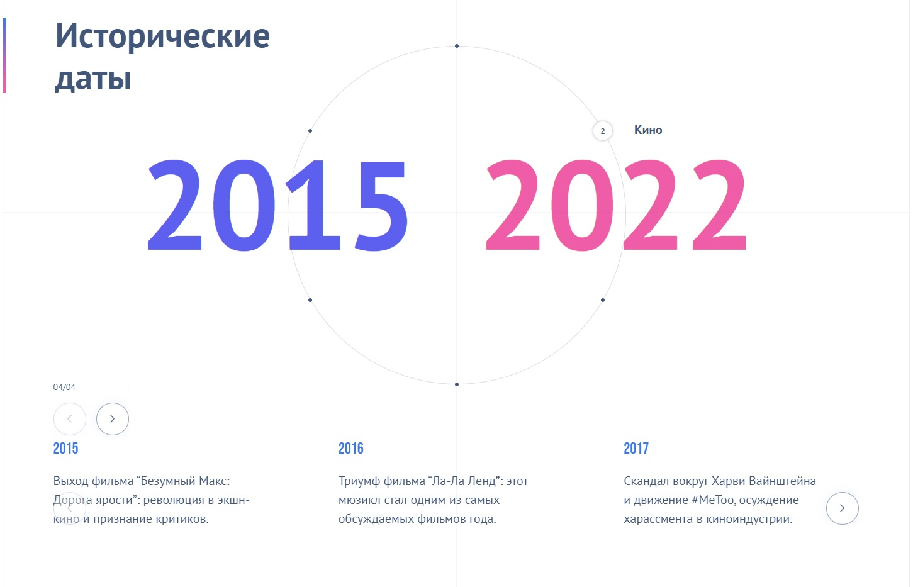

# Timelines and Events

## Информация о проекте

В этом проекте я разработал приложение Timelines and Events. 
В приложении можно посмотреть значимые события из выбранной пользователем тематики за указанные годы. 

Пользователь может выбирать тематики с помощью навигационных точек на окружности (Наука, Кино, Спорт, Музыка, Технологии и ИТ, Экологии). Пользователь может перемещаться по годам и событиям в выбранном временном промежутке с помощью слайдера. Пользователь может менять временной промежуток с помощью еще одного слайдера.



В проекте использовались React, sass, swiper.

</details>

## Инструкции по сборке и запуску

1. Склонировать себе этот репозиторий

```
git clone https://github.com/NikolaiGavrilov/timelines-and-events
```

2. Перейти в директорию

```
cd timelines-and-events
```

3. Выполнить команду ниже для установки необходимых node_modules

```
npm i
```

4. Запустить сервер разработки, выполнив в терминале команду

```
npm start
```

5. Дождаться открытия окна браузера с развернутым проектом или самостоятельно
   перейти в браузере по следующему пути:

```
http://localhost:3000/
```
